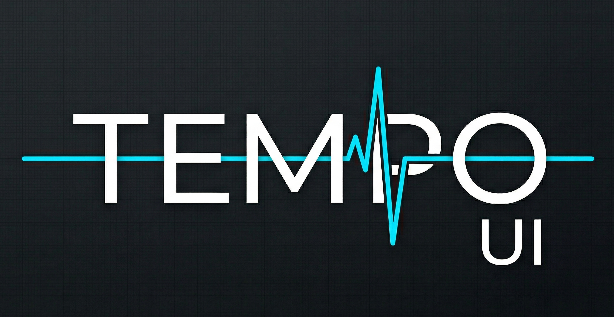

# TEMPO UI
### Premise
TempoUI was created as a middle ground between the user interface giants Qt and Dear ImGui. It is created as a retained-mode UI library similar to Qt, but adopts some aspects from ImGui alongside custom features designed for rapid iteration and development. In essence this library tries to bridge the runtime speed of a compiled Qt application and the development speed of an ImGui application.
### *Important Notes*
To get started using this library there are some smaller features that have to be explained. Some features are disabled by default.

```cpp
#define GLFW_UI
```
This enables glfw for the inputs of the UI. 

---
```cpp
#define OPENGL
```
This enables OpenGL to be used as the backend. This will also implement the Image- and TextHandler and shader utilizing GLAD.

---
``` cpp
#define NETWORK 
```
This enables socket support using TCP protocols. Features for **server** and **client** are supported.

---
``` cpp
#define LAYOUT_LOADER 
```
This enables layout loading through JSON files.

---
###### *Planned:*
- [ ] Improving Drag and Drop
- [ ] Adding support for **Vulkan** backend
- [ ] Adding support for **SDL2**

All of these have to be defined before the inclusion of the *TempoUI.h* file or when compiling as a static library. 

### *Getting Started*

TempoUI itself doesn't include the capabilities of window management, therefore this has to be handled by you. TempoUI works out of its UIRenderer class and only really requires 4 function calls to work itself. 

---
**Minimal Working Example**:

``` cpp
#include "TempoUI.h"

// Window context already created

UIRenderer ui_renderer(/*JSON theme data, if wanted (raw data)*/);
ui_renderer.init(window_width, window_height);
// Multiple input bindings will be added later, change GLFW with wanted handler
UI::GLFW::init_input(window_context);

// In run loop
if(ui_renderer.draw(delta_time))
{
	// swap buffers and other wanted logic
}
```

##### **General Element Management**

*Element Creation:*
``` cpp
ui_renderer.create_element<Type>(Arguments);
```
Element Removal:
``` cpp
ui_renderer.remove_element_from_canvas<Type>(identifier);
```
Element Access:
``` cpp
ui_renderer.get_element<Type>(identifier); // Gets a pointer to the element
```

---
##### **Element-Element interaction**
When rendering the UI, children will always render on top of its parents.

*Element Creation:*
``` cpp
element_ptr->create_child<Type>(Arguments);
```
or
``` cpp
element_ptr->add_child(/*Unique Pointer to a element*/);
```

*Element Removal:*
``` cpp
element_ptr->remove_element(identifier);
```

*Element Access:*
``` cpp
element_ptr->get_element<Type>(identifier); // Gets a pointer to the element
```

---
##### **Element Types**
- **Containers:** [Canvas](docs/Canvas), [Bordered Box](docs/BorderedBox), [Horizontal Box](docs/HorizontalBox), [Vertical Box](docs/VerticalBox), [Scroll Box](docs/ScrollBox), [Wrap box](docs/Wrapbox), 
[Combo box](docs/Combobox).
- **Interactive:** [Button](docs/Button), [Checkbox](docs/Checkbox), [Slider](docs/Slider), [Toggle Slider](docs/ToggleSlider), [Text Area](docs/TextArea), [Input Box](docs/InputBox), [Color Picker](docs/ColorPicker). 
- **Monitoring:** [Progress Bar](docs/ProgressBar), [Graph View](docs/GraphView).
- **Other:** [Image](docs/Image), [Text](docs/Text).

---
#### **JSON**
##### *Layout*
[Documentation](docs/Layout.md)
The main way of handling UI within TempoUI is by utilizing its JSON layout functionality.

``` cpp
// This will load the layout if it exists or create it
ui_renderer.load_layout(/*json file name*/);
```
---
*Hot-reloading Layout:*
If you want to hot-reload the layout of your UI, this is the way that it is intended.

``` cpp
// Bind a callback to layout change
ui_renderer.bind_layout_callback([](){
	// Elements with special properties
});
```

``` cpp
// Bind a key press to a function
ui_renderer.remove_element_from_canvas<Canvas>("Layout_Canvas");
ui_renderer.load_layout(/*json file name*/);
```
##### *Theme*
[Documentation](docs/Theme)
It is highly recommended to utilize a theme for your UI. Without a theme, every color needs to be coded in manually which is a hassle.

*Loading theme initially*
``` cpp
// During initialization
UIRenderer ui_renderer(/*JSON theme data, if wanted (raw data)*/);
```

*Hot-reloading theme*
``` cpp
// Before element creation
ThemeManager::get().load_theme(/*JSON theme data*/);
ui_renderer.get_element<Canvas>("Screen")->theme_updated();
```
